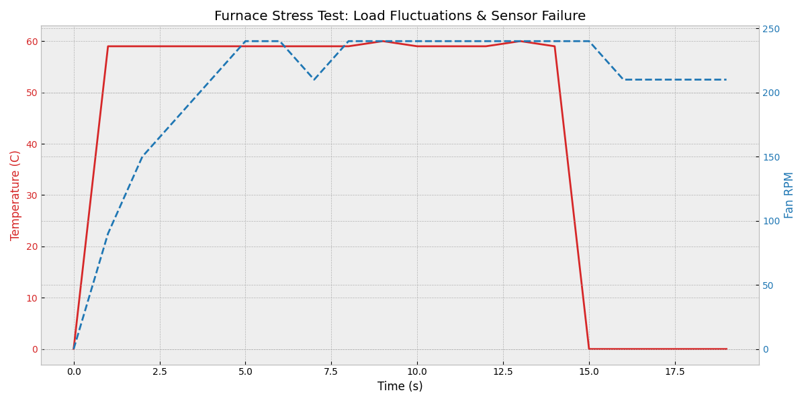
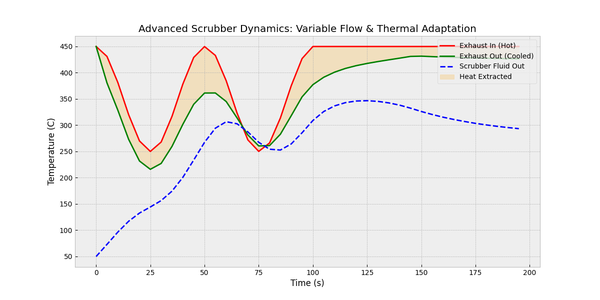
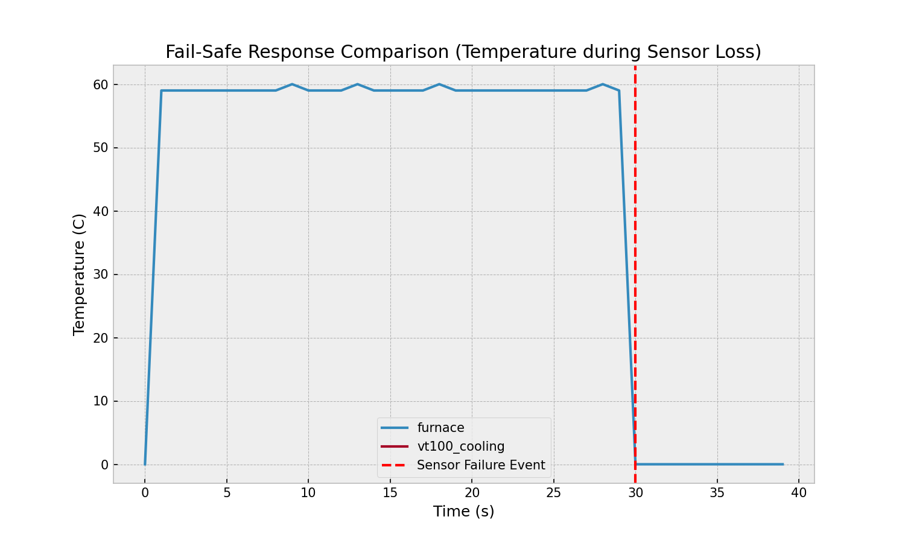
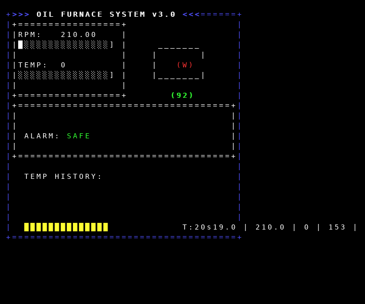
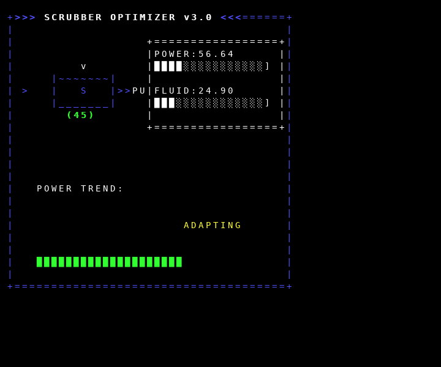
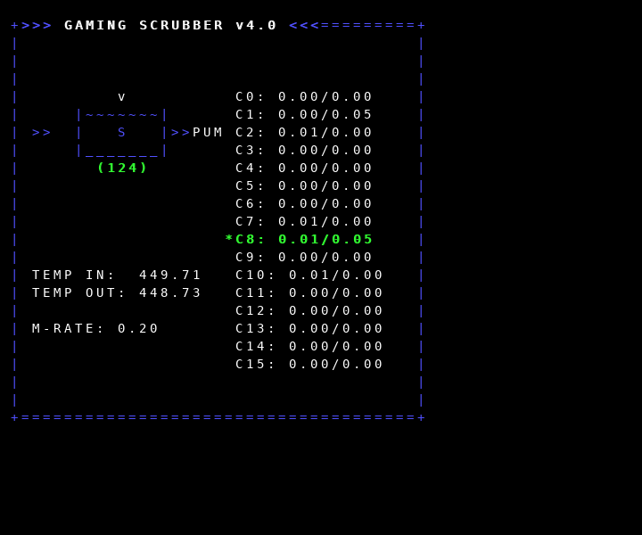
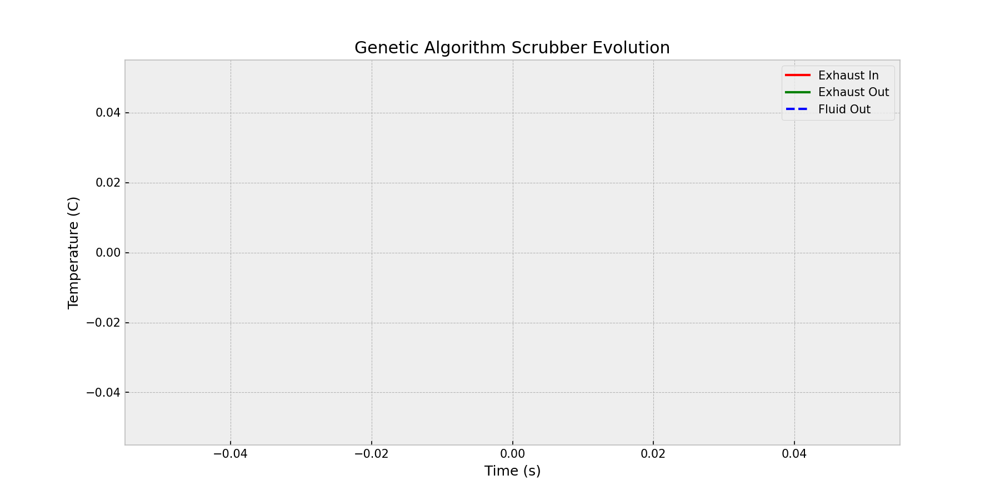

# Oil Furnace & Exhaust Scrubber Control System

A multi-layered control and simulation framework for high-efficiency oil furnace management and heat extraction.

## System Overview
This project provides a robust suite of Arduino-compatible controllers for furnace airflow and exhaust scrubbing. It includes a sophisticated physical simulation environment (C++ backend) and a graphical dashboard (Tkinter) for real-time telemetry and stress testing.

## Core Features
- **Adaptive Scrubber Control**: Multiple algorithms (PSO, Genetic, PID, Lyapunov) for Maximum Power Point Tracking (MPPT) of heat extraction.
- **Fail-Safe Safety Layers**: Plausibility checks, sensor failure detection, and automatic transition to "safe modes."
- **High-Fidelity Simulation**: Models thermal inertia, mass flow, backpressure, and hardware aging (fouling).
- **Professional Visualization**: Colorful VT100 dashboards with ASCII art animations and real-time trend graphs.

## Benchmarking Results
All scrubber controllers are evaluated against a 50-second dynamic load test.

| Controller | Avg Power (W) | Total Energy (J) | Status |
|------------|---------------|------------------|--------|
| gaming_scrubber.ino | 70.07 | 2802.7 | PASS |
| scrubber_simple_param_array.ino | 66.44 | 2657.6 | PASS |
| scrubber_stabilizer.ino | 65.89 | 2635.4 | PASS |
| pso_scrubber.ino | 56.80 | 2272.0 | PASS |
| scrubber_optimized.ino | 43.84 | 1753.4 | PASS |
| sorting_scrubber.ino | 58.29 | 2331.7 | PASS |

## Performance Visuals

### 1. Furnace Response & Stress Test

*Real-time PID stabilization during varying combustion loads and a critical sensor failure event.*

### 2. Scrubber Thermal Efficiency

*Exhaust-to-fluid heat exchange performance under dynamic mass flow conditions.*

### 3. Fail-Safe Reliability

*Comparison of controller recovery times after simulated sensor loss.*

### 4. Interactive Dashboard

*High-fidelity terminal UI featuring the VT100Visualizer.h library.*

### 5. Scrubber Optimization Telemetry

*Specialized dashboard for monitoring scrubber efficiency, featuring real-time heat exchange animations.*

### 6. Genetic Algorithm (Gaming Scrubber)
The `gaming_scrubber.ino` uses a population-based Genetic Algorithm to evolve optimal control parameters.


*Real-time population monitoring dashboard for the Genetic Algorithm controller.*


*Evolution of scrubber performance using the Genetic Algorithm.*

## Installation & Usage

### Prerequisites
- Python 3.10+
- `pip install matplotlib pillow numpy`
- `g++` compiler

### Running Tests
Automated verification and benchmarking:
```bash
python3 run_tests.py
```

### Graphical Simulator
Launch the interactive dashboard:
```bash
python3 furnace_gui.py
```

## Theory of Operation
The `FurnaceSimulator` solves differential equations for heat transfer:
$$Q_{in} = \dot{m} \cdot C_p \cdot \Delta T \cdot \eta_{aging}$$
where $\eta_{aging}$ represents the hardware fouling factor, controllable via the GUI.

---
*Developed for robust industrial furnace simulation and control experimentation.*
