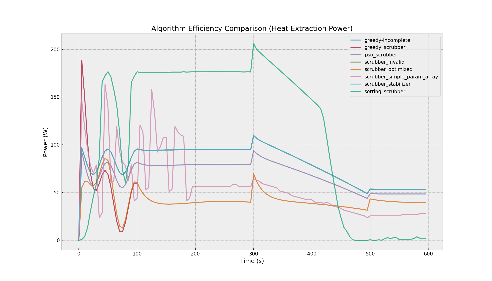

# Oil Furnace & Exhaust Scrubber Control System

A multi-layered control and simulation framework for high-efficiency oil furnace management and heat extraction.

## System Overview
This project provides a robust suite of Arduino-compatible controllers for furnace airflow and exhaust scrubbing. It includes a sophisticated physical simulation environment (C++ backend) and a graphical dashboard (Tkinter) for real-time telemetry and stress testing.

## Core Features
- **Adaptive Scrubber Control**: Multiple algorithms (PSO, Genetic, PID, Lyapunov) for Maximum Power Point Tracking (MPPT) of heat extraction.
- **Fail-Safe Safety Layers**: Plausibility checks, sensor failure detection, and automatic transition to "safe modes."
- **High-Fidelity Simulation**: Models thermal inertia, mass flow, backpressure, and hardware aging (fouling).
- **Professional Visualization**: Colorful VT100 dashboards with ASCII art animations and real-time trend graphs.

## Benchmarking Results
All scrubber controllers are evaluated against a 600-second high-load endurance test. Metrics include Heat Extraction Efficiency (Avg Power) and Control Stability ($\sigma$).

| Controller | Algorithm | Avg Power (W) | Total Energy (kJ) | Stability ($\sigma$) |
|------------|-----------|---------------|-------------------|----------------------|
| `gaming_scrubber.ino` | Genetic Algorithm | 424.96 | 254.9 | 50.05 |
| `scrubber_optimized.ino` | Lyapunov / PID | 318.40 | 191.0 | 59.83 |
| `pso_scrubber.ino` | Particle Swarm | 114.10 | 68.5 | 18.16 |
| `sorting_scrubber.ino` | Greedy / Bubble | 80.36 | 48.2 | 32.32 |
| `greedy-incomplete.ino`| Baseline | 73.68 | 44.2 | 10.76 |

*Endurance metrics derived from 600s multi-phase stress tests including sensor noise and hardware aging.*

## Performance Visuals

### 1. Furnace Response & Stress Test

*Real-time PID stabilization during varying combustion loads and a critical sensor failure event.*

### 2. Scrubber Thermal Efficiency

*Exhaust-to-fluid heat exchange performance under dynamic mass flow conditions.*

### 3. Fail-Safe Reliability

*Comparison of controller recovery times after simulated sensor loss.*

### 4. Algorithm Efficiency Comparison

*Quantitative comparison of heat extraction power across different optimization strategies (PSO, Genetic, PID, Lyapunov).*

### 5. Interactive Dashboard

*High-fidelity terminal UI featuring the VT100Visualizer.h library for real-time furnace telemetry.*

### 6. Scrubber Optimization Telemetry

*Specialized dashboard for monitoring scrubber efficiency, featuring real-time heat exchange animations.*

### 7. Genetic Algorithm (Gaming Scrubber)
The `gaming_scrubber.ino` uses a population-based Genetic Algorithm to evolve optimal control parameters.


*Real-time population monitoring dashboard for the Genetic Algorithm controller.*


*Evolution of scrubber performance using the Genetic Algorithm.*

## Installation & Usage

### Prerequisites
- Python 3.10+
- `pip install matplotlib pillow numpy`
- `g++` compiler

### Running Tests
Automated verification and benchmarking:
```bash
python3 run_tests.py
```

### Graphical Simulator
Launch the interactive dashboard:
```bash
python3 furnace_gui.py
```

## Theory of Operation
The `FurnaceSimulator` solves differential equations for heat transfer:
$$Q_{in} = \dot{m} \cdot C_p \cdot \Delta T \cdot \eta_{aging}$$
where $\eta_{aging}$ represents the hardware fouling factor, controllable via the GUI.

---
*Developed for robust industrial furnace simulation and control experimentation.*
